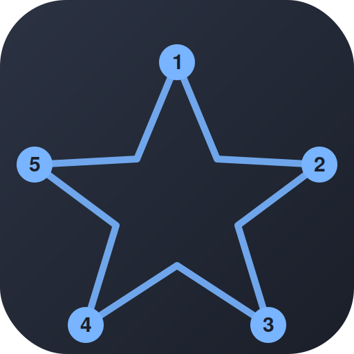
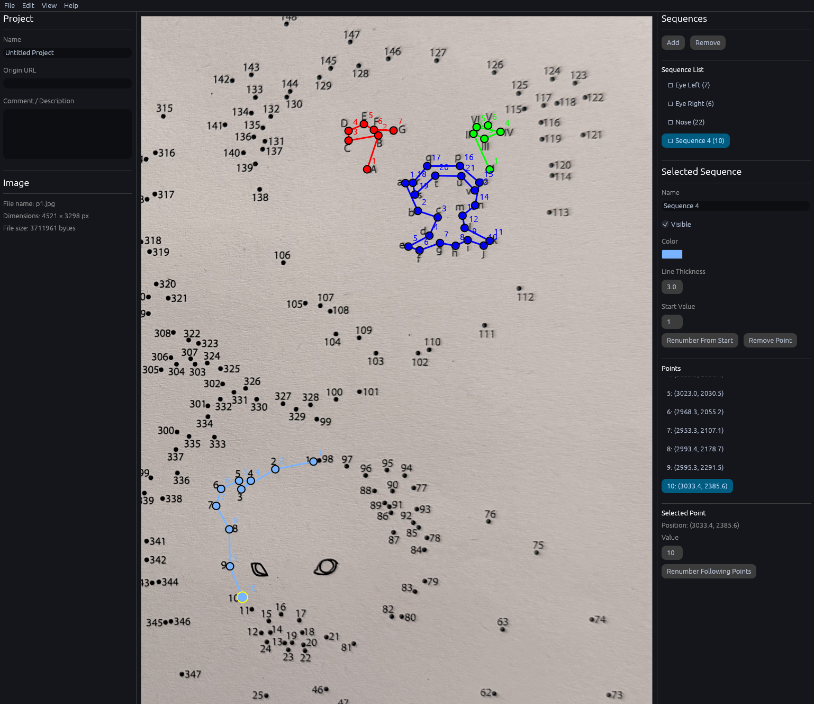
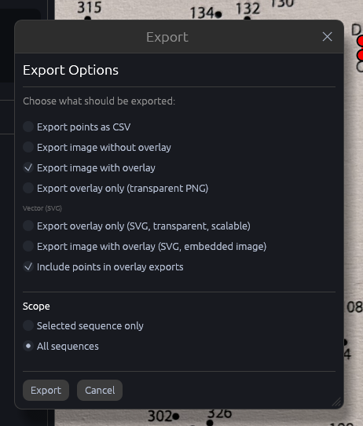

  

<h1 align="center">DotToDot Studio</h1>

  
  
  

---

## Über dieses Projekt

Während meines Aufenthaltes im Universitätsklinikum Tübingen habe ich begonnen, mich mit Rust zu beschäftigen. Dieses Projekt war eines der ersten, die mich der Sprache näher gebracht haben.

Voller Vorbehalte und der Angst, vor einem weißen Blatt Papier ohne Idee zu sitzen — umgangssprachlich wohl als "Schreibblockade" tituliert — habe ich DotToDotStudio nach der ersten Ergotherapie-Stunde begonnen.

DotToDot Studio ist eine Hommage an alle Damen und Herren, die mich während dieser Zeit klinisch unterstützt haben. Mit der Veröffentlichung dieses Projektes möchte ich mich in aller Form für diese Unterstützung bedanken.

And here we go — it is free for all :smile:

---

## About this Project

During my stay at Tübingen University Hospital, I started learning Rust. This project was one of the first that really brought me closer to the language.

Full of reservations and afraid of sitting in front of a blank sheet of paper without an idea — commonly known as "writer's block" — I started DotToDotStudio right after my first occupational therapy session.

DotToDot Studio is a tribute to everyone who supported me clinically during that time. By releasing this project, I want to formally thank them for that support.

And here we go — it is free for all :smile:

---

## Was mache ich damit?

Zahlenpunkte (Dots) miteinander verbinden — ganz klassisch, nur digital. Als Vorlage dient ein beliebiges Bild, zum Beispiel ein eingescanntes Malbuch, ein Foto oder eine selbst entworfene Grafik.

### Ablauf

1. **Bild importieren** — Über `File → Import Image` ein Referenzbild laden. Auch sehr hochauflösende Vorlagen (im Beispiel oben: 4521 × 3298 px) lassen sich flüssig bearbeiten.
2. **Sequenzen anlegen und Farbe vergeben** — Im Sequences-Panel per `Add` eine neue Sequenz erstellen, ihr einen sprechenden Namen geben (z. B. "Eye Left", "Nose") und eine eigene Farbe sowie Linienstärke zuweisen. So bleiben mehrere Motive im selben Bild sauber getrennt.
3. **Punkte setzen und verbinden** — Mit Klicks auf dem Bild werden nummerierte Punkte in der aktiven Sequenz gesetzt. Punkte lassen sich jederzeit verschieben, einfügen, entfernen und über `Renumber From Start` bzw. `Renumber Following Points` neu durchnummerieren.
4. **Zoomen und Scrollen** — Mit dem Mausrad zoomen, per Ziehen den Ausschnitt verschieben — praktisch für Detailarbeit an großen Vorlagen.
5. **Projekt speichern und laden** — Der gesamte Zustand (Bild, Sequenzen, Punkte) wird in einer einzigen SQLite-Datei gespeichert und über `File → Save` / `Open` jederzeit wieder geladen.
6. **Bild exportieren** — Als PNG (mit oder ohne Overlay, wahlweise transparent) oder als skalierbares SVG. Der Export lässt sich auf die aktuell gewählte Sequenz oder auf alle Sequenzen anwenden, optional inklusive Punktbeschriftung.

---

## What can I do with it?

Connect the dots — the classic pastime, just digital. Any image can serve as a template: a scanned coloring book page, a photo, or artwork you drew yourself.

### Workflow

1. **Import an image** — Load a reference image via `File → Import Image`. Even very high-resolution templates (4521 × 3298 px in the example above) stay smooth to work with.
2. **Create sequences and assign a color** — Add a new sequence in the Sequences panel via `Add`, give it a descriptive name (e.g. "Eye Left", "Nose"), and pick its own color and line thickness. This keeps multiple motifs in the same image cleanly separated.
3. **Place and connect points** — Click on the image to place numbered points in the active sequence. Points can be moved, inserted, removed, and renumbered at any time via `Renumber From Start` / `Renumber Following Points`.
4. **Zoom and pan** — Zoom with the mouse wheel, pan by dragging — handy for detail work on large templates.
5. **Save and load a project** — The entire state (image, sequences, points) is stored in a single SQLite file and can be reloaded anytime via `File → Save` / `Open`.
6. **Export the image** — As PNG (with or without overlay, optionally transparent) or as scalable SVG. Export can target just the selected sequence or all sequences, optionally including point labels.

---

## Download

Fertige Builds für Linux, macOS (Apple Silicon) und Windows gibt es auf der [Releases-Seite](https://github.com/AndreasPantle/DotToDotStudio/releases).

Prebuilt binaries for Linux, macOS (Apple Silicon) and Windows are available on the [Releases page](https://github.com/AndreasPantle/DotToDotStudio/releases).

---

## License

MIT — see [LICENSE](LICENSE).
